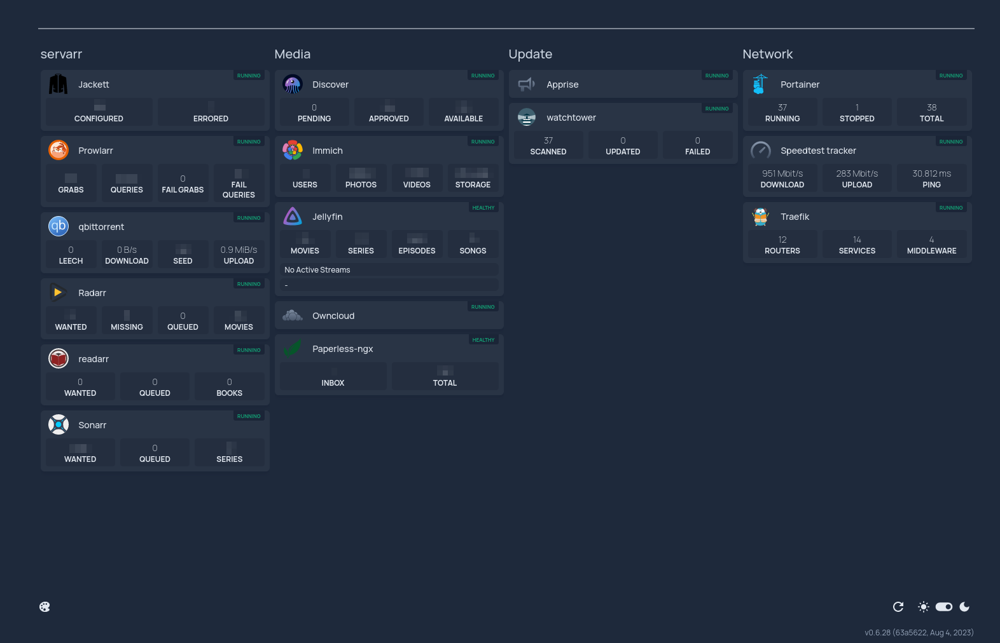

# my server setup

## show case

### Internal Dashboard



### External Dashboard


## bare metal description

```bash
$ sudo inxi --filter --width 90 -SGIMCPDp --ms
System:
  Kernel: 6.4.10-arch1-1 arch: x86_64 bits: 64 Console: pty pts/4 Distro: Arch Linux
Machine:
  Type: Desktop Mobo: ASRock model: 970M Pro3 serial: <filter> UEFI: American Megatrends
    v: P1.60 date: 06/17/2016
Memory:
  System RAM: total: 8 GiB available: 7.73 GiB used: 4.46 GiB (57.7%)
  Report: arrays: 1 slots: 4 modules: 2 type: DDR3
CPU:
  Info: 6-core model: AMD Phenom II X6 1090T bits: 64 type: MCP cache: L2: 3 MiB
  Speed (MHz): avg: 800 min/max: 800/3200 cores: 1: 800 2: 800 3: 800 4: 800 5: 800
    6: 800
Graphics:
  Device-1: NVIDIA GP107 [GeForce GTX 1050 Ti] driver: nvidia v: 535.98
  Display: server: X.org v: 1.21.1.8 driver: N/A resolution: <missing: xdpyinfo/xrandr>
  API: OpenGL Message: Unable to show GL data. Required tool glxinfo missing.
Drives:
  Local Storage: total: 4.31 TiB used: 187.3 GiB (4.2%)
  ID-1: /dev/sda vendor: Kingston model: SA400S37240G size: 223.57 GiB
  ID-2: /dev/sdb vendor: Western Digital model: WD40EFAX-68JH4N1 size: 3.64 TiB
  ID-3: /dev/sdc vendor: Seagate model: ST3500312CS size: 465.76 GiB
Partition:
  ID-1: / size: 223.28 GiB used: 69.95 GiB (31.3%) fs: btrfs dev: /dev/sda2
  [...]
  ID-3: /boot size: 299.4 MiB used: 56.5 MiB (18.9%) fs: vfat dev: /dev/sda1
  [...]
  ID-24: /srv size: 223.28 GiB used: 69.95 GiB (31.3%) fs: btrfs dev: /dev/sda2
  ID-25: /swap size: 223.28 GiB used: 69.95 GiB (31.3%) fs: btrfs dev: /dev/sda2
  [...]
  ID-27: /var/cache size: 223.28 GiB used: 69.95 GiB (31.3%) fs: btrfs dev: /dev/sda2
  [...]
  ID-37: /var/log size: 223.28 GiB used: 69.95 GiB (31.3%) fs: btrfs dev: /dev/sda2
  ID-38: /var/tmp size: 223.28 GiB used: 69.95 GiB (31.3%) fs: btrfs dev: /dev/sda2
Info:
  Processes: 531 Uptime: 12h 29m Shell: Sudo inxi: 3.3.28
```

- `/dev/sda` is a 120GB Kingston ssd, hold the root of the system.
  - `/dev/sda1` -> `/boot`: hold the boot-loader (`fat32` partition of 300MB)
  - `/dev/sda2`: btrfs partition
- `/dev/sdb` is a 4TB WD Red, for data storage.
  - `/dev/sdb1`: btrfs partition
- `/dev/sdc` is a 500GB old hdd, not trustworthy and only hold torrents. Is formatted in EXT4 and is not part of the btrfs layout.
  - `/dev/sdc1`: EXT4 partition

### btrfs sub-volumes layout

The 120GB Kingston hold the system, so `/`, `/home` are on this drive.
The 4TB WD Red hold some docker volumes and other data.

#### 120GB ssd

The layout of the main drive is:

- `@` -> `/`
- `@home` -> `/home`
- `@cache` -> `/var/cache`
- `@log` -> `/var/log`
- `@tmp` -> `/var/tmp`
- `@srv` -> `/srv`

Following [Snapper#Suggested filesystem layout](https://wiki.archlinux.org/title/Snapper#Suggested_filesystem_layout) and [Snapper#Preventing slowdowns](https://wiki.archlinux.org/title/Snapper#Preventing_slowdowns).

All the mounts are done with `fstab`, for example:

```bash
UUID=<...> / btrfs rw,relatime,ssd,space_cache=v2,subvolid=256,subvol=/@,compress=zstd 0 0
```

The options are generated using the `genfstab` script ([extra/arch-install-scripts](https://man.archlinux.org/man/extra/arch-install-scripts/genfstab.8.en))

#### 4TB WD Red

- `@data` -> `/data/wd-red`: generic data folder.
- `docker-volumes`: folder that contains some docker volumes mapped to btrfs sub-volumes. (Note, this is not a sub-volume but a normal folder.)

## docker configuration

Docker is configured to use the BTRFS storage driver, as described [here](https://docs.docker.com/storage/storagedriver/btrfs-driver/). This way the images of the containers are stored in sub-volumes and not included in the snapshots.

## snapper configuration

First, create the config for the sub-volumes you are interested in backing-up:

```bash
sudo snapper -c root create-config /
sudo snapper -c home create-config /home
```

### fix snapper sub-volume layout

As described in [Snapper#Suggested filesystem layout](https://wiki.archlinux.org/title/Snapper#Suggested_filesystem_layout) I moved the `.../.snapshots` out of the sub-volume I'm taking a snapshot of.

To do so I created a folder in the btrfs root (`snapshots/`) and inside the sub-volumes that will hold the snapshots:

```bash
sudo btrfs subvolume list /
[...]
ID 413 gen 3398 top level 5 path snapshots/@root-snap
ID 414 gen 3397 top level 5 path snapshots/@home-snap
[...]
```

Than I mapped the sub-volumes to the `.../.snapshots` using `fstab`:

```fstab
UUID=<...> /.snapshots btrfs rw,relatime,ssd,space_cache=v2,subvolid=413,subvol=/snapshots/@root-snap,compress=zstd  0 0

UUID=<...> /home/.snapshots btrfs rw,relatime,ssd,space_cache=v2,subvolid=414,subvol=/snapshots/@home-snap,compress=zstd  0 0
```

### snapper configs

The configs are located in `/etc/snapper/configs`. I enabled `NUMBER_CLEANUP`, `TIMELINE_CREATE` and `TIMELINE_CLEANUP`. And changed the limits to keep less than 10 snapshots in total.

### topgrade snapper pre-snap

To upgrade my system I use topgrade. I could have added snapper to a pacman hook, but since topgrade also does a lot of other stuff I preferred to add a pre and post step. The full topgrade config can be found [here](https://github.com/simone-viozzi/my-dot-files/blob/dotfiles-server/.config/topgrade.toml)

```toml
[pre_commands]
"snap before upgrade" = """echo \"taking a snap...\" && \
                                   sudo snapper -c root create -t single -d \"snap before upgrade\" -c number && \
                                   echo \"snap done...\""""

[post_commands]
"snapper cleanup" = """echo \"cleaning up the snaps...\" && \
                       sudo snapper -c root cleanup number && \
                       sudo snapper -c root list"""
```

### snap-sync setup

The ssd is kind of old and will die before the WD Red. To prepare for this scenario I used `snap-sync` ([link](https://github.com/qubidt/snap-sync)) to send the snapshots from the ssd to the hdd.

To set this up I created a sub-volume in the WD Red, `@system-backup`, and mounted it with `fstab` to `/system-backup`. To configure `snap-sync` you have to run in manually the first time:

```bash
sudo snap-sync --UUID <UUID of WD Red> --subvolid <subvol id of @system-backup> -c "root home" -q -n
```

To avoid the creation of another 2 sub-volumes, when asked for the path leave it empty.

The directory structure will be:

```bash
/system-backup/
├── home/
│  ├── 8/
│  └── 9/
└── root/
   ├── 9/
   └── 10/
```

As advised in the man of `snap-sync` to run it periodically you need to create a systemd unit and timer. To set the timer see [link](https://wiki.archlinux.org/title/systemd/Timers#Realtime_timer).

```bash
$ sudo vim /etc/systemd/system/snap-sync.service
[Unit]
Description=Run snap-sync backup

[Install]
WantedBy=multi-user.target

[Service]
Type=simple
ExecStart=/usr/bin/systemd-inhibit snap-sync --UUID <UUID of WD Red> --subvolid <subvol id of @system-backup> -c "root home" -q -n

$ sudo vim /etc/systemd/system/snap-sync.timer
[Unit]
Description=Run snap-sync every 3 days

[Timer]
OnCalendar=*-*-01,04,07,10,13,16,19,22,25,28,31 00:00:00
AccuracySec=12h
Persistent=true

[Install]
WantedBy=timers.target
```

Then you need to enable the timer:

```bash
sc-enable-now snap-sync.timer
```

To debug the unit you can run it with `sc-start`, it will do it's stuff and exit.

#### meaning of systemd-inhibit

`snap-sync` is a wrapper around btrfs send receive, for this reason it could take some time to move the data between the 2 drives. With `systemd-inhibit` I can prevent the shutdown of the server while the process is running. The poweroff / reboot command must include `--check-inhibitors=yes`, so for example:

```bash
systemctl poweroff --check-inhibitors=yes
```

### snap-sync cleanup

By default `snap-sync` have no clean-up algorithm. A user created a script to implement the clean-up, [link](https://gist.github.com/alanorth/fdaa3f3be16b58822a4a876afbd62604).

To use it, download, add execution permissions and move it to `/usr/local/bin/snap-sync-cleanup.sh`. Than you need systemd service and timer:

```
$ sudo vim /etc/systemd/system/snap-sync-cleanup.service
[Unit]
Description=Run snap-sync-cleanup

[Install]
WantedBy=multi-user.target

[Service]
Type=simple
ExecStart=/usr/local/bin/snap-sync-cleanup.sh

$ sudo vim /etc/systemd/system/snap-sync-cleanup.timer
[Unit]
Description=Run snap-sync-cleanup every 3 days

[Timer]
OnCalendar=*-*-01,04,07,10,13,16,19,22,25,28,31 00:00:00
AccuracySec=12h
Persistent=true

[Install]
WantedBy=timers.target

$ sc-enable-now snap-sync-cleanup.timer
```

## docker volumes on the WD Red

To create a docker volume mapped to a btrfs sub-volume you need to:

- create the sub-vol: `btrfs subvolume create @name`
- create the docker volume:

    ```bash
    docker volume create --driver local --opt type=btrfs \
        --opt device=/dev/sdb1 \
        --opt o=subvol=<path>/@name \
        name
    ```

- than you can use it in the docker-compose with:

    ```yaml
    volumes:
      name:
        external: true
    ```

### docker volumes backup

To back up some of the docker volumes to an external cloud storage I wrote [my own backup script](https://github.com/simone-viozzi/btrfs2cloud-backup). To set it up you just need to configure snapper for the docker volume, as described on the arch wiki (with .snapshots mapped to a subvolume outsise the one you are taking a backup of).

## Traekik reverse proxy

As a reverse proxy for every service that need to be exposed to the web I use traefik. Is configured to work on the network `proxy`, created with:

```bash
docker network create proxy
```

And referenced in the docker-compose files as:

```yaml
networks:
  proxy:
    external: true
```

### Services that have the web interface on ports different than 80

To redirect the traffic to the correct port you need to add:

```yaml
labels:
  - "traefik.http.routers.<service name>.service=<service name>-svc"
  - "traefik.http.services.<service name>-svc.loadbalancer.server.port=<port of the service>"
```

### Containers that are part of more than one network

To tell traefik in which network it should search the service, you need to add the following label:

```yaml
service:
  networks:
    media:
    proxy:
  labels:
    [...]
    - "traefik.docker.network=proxy"
```

## Apprise

To get notification from the servers I did set up [apprise](https://github.com/caronc/apprise-api) and a telegram bot.

In the apprise configuration interface you can set up some topics:

```bash
general=tgram://<bot token>/<chat id>

admin=tgram://<bot token>/<chat id>
```

Then you can use the topic with:

```bash
curl -X POST -d '{"tag":"admin", "body":"test message"}' \
    -H "Content-Type: application/json" \
    http://localhost:8005/notify/apprise
```

To connect it with other containers I created an external network, then added both apprise and the other container to that network.

### Use outside docker network vs use inside the docker network

Apprise use the port 8000, but in my case it war already used by portainer. To overcome this I set the port mapping of apprise to `- 8005:8000`. This means that a notification from the system must be sent to `http://localhost:8005/notify/apprise`. While a notification from within the docker network must be sent to `http://apprise:8000/notify/apprise`.

###  + Apprise = <3

To enable notifications through apprise you need the [Webhook](https://github.com/jellyfin/jellyfin-plugin-webhook) plugin. It can be installed directly from the [plugin section of Jellyfin](https://jellyfin.org/docs/general/server/plugins/).

Then, if for example you want a notification when an item is added, you need to create a `generic destination`:

1. set the correct webhook url: `http://apprise:8000/notify/apprise`. You can confirm that the url is correct with `docker exec -it jellyfin bash` than using curl from within the container.
1. check `Item Added`
1. use a template like:

    ```json
    {
      "tag": "general",
      {{#if_equals ItemType 'Season'}}
          "body": "<b>{{ItemType}} ora disponibile</b>\n\n<b>{{{SeriesName}}} ({{Year}})</b>\n<b><em>{{{Name}}}</em></b>\n{{Overview}}\n\n<b>Durata: {{RunTime}}</b>\n\nStato: Disponibile",
      {{else}}
        {{#if_equals ItemType 'Episode'}}
              "body": "<b>episodio ora disponibile</b>\n\n<b>{{{SeriesName}}} ({{Year}})</b>\n<b>S{{SeasonNumber00}}E{{EpisodeNumber00}}</b> - <b><em>{{{Name}}}</em></b>\n{{Overview}}\n\n<b>Durata: {{RunTime}}</b>\n\nStato: disponibile",
          {{else}}
              "body": "<b>{{ItemType}} ora disponibile</b>\n\n<b>{{{Name}}} ({{Year}})</b>\n{{Overview}}\n\n<b>Durata: {{RunTime}}</b>\n\nStato: disponibile",
          {{/if_equals}}
      {{/if_equals}}
      "format": "html"
    }
    ```

    I took the template from [here](https://github.com/jellyfin/jellyfin-plugin-webhook/blob/master/Jellyfin.Plugin.Webhook/Templates/Telegram.handlebars) and modified it following [this](https://github.com/caronc/apprise/wiki/Notify_telegram).

    With the `tag` key you can specify to which topic the notification will be sent.

1. Add a request header:

    - key: `Content-Type`
    - value: `application/json`

## Jellyserr link inside Jellyfin menu

Follow [this](https://jellyfin.org/docs/general/clients/web-config/#custom-menu-links) and [this](https://gist.github.com/thornbill/bfdcdb2d79440095b108e8c1f9e38a2f). The secret is to not put the `menuLinks` at the end, but in the middle under `themes`.

